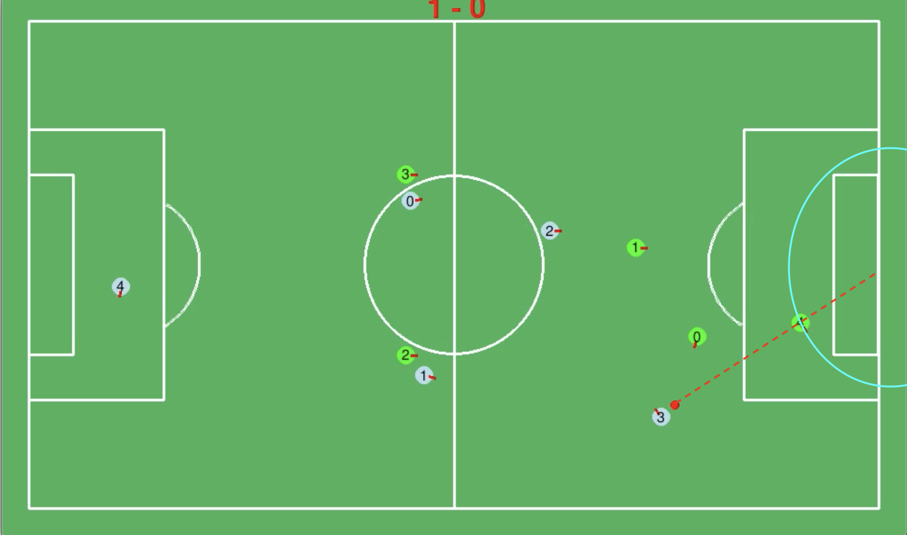
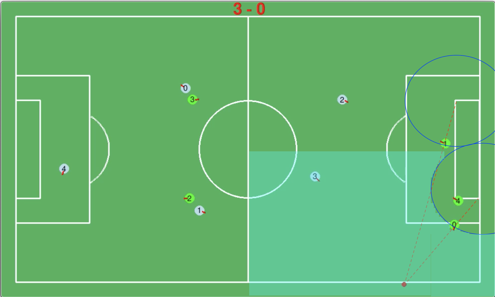
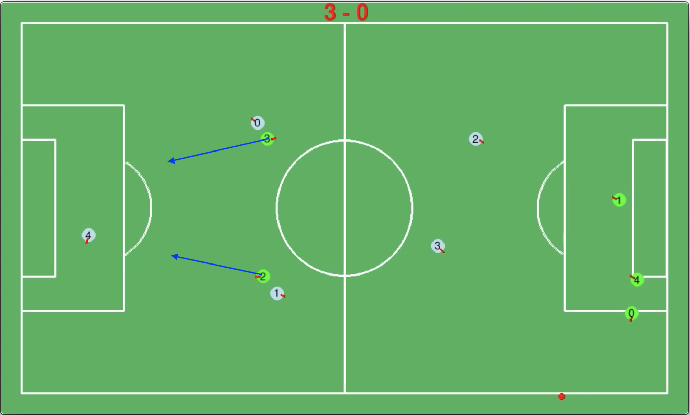

# Strategy Team 0

## Structure - Subsumption Architecture

Each of the five robots in the team is given a function/football position: 
1. Two strikers (left and right)
2. Two defenders (left and right)
3. One goalkeeper

Each player has a base logic that is related to the playing position. This logic is executed during every iteration.
After each player is assigned the base function, the shared logic searches for initiating action. 
If such action is found, the base action is overwritten with the initiating action.

__Comment!__ this is Subsumption Architecture (look lecture 6 Robotics foundation), also in "ROS architecture" is this diagram with it.

## Base actions

### Goal Keeper

The goalkeeper operation space is defined as an ellipse with a centre in the middle of the net (Figure 1). 
The robot desired position is defined as the cross point of the ellipse and vector (ball to net-mid-point).  

__Figure 1:__ Goalkeeper operation space

### Defenders

Defenders base action depends on the ball distance from the team's net. 
If the ball is in a "safe" distance, defenders are a half distance away between the team's net and the ball (Figure 2).
The latitude (y coordinate) of each defender is the same as the ball latitude with a constrain not to move outside its an assigned field quarter.

__Figure 2:__ Defenders position when the ball is far from the team's net

When the ball gets close to the team's net, the defenders logic changes to not interrupt the goalkeeper and defend the corners of the net.
As shown in Figure 3, the defenders move around the corners and in line with the ball.

Also, in Figure 3, the operation region for the left defender is presented in shaded blue. 
The right defender has mirrored the operation region along the x-axis.

__Figure 3:__ Defenders position when the ball is close to team's net and left defender's operation region.

### Strikers

Strikers have a predefined sub-optimal base position (Figure 4) to conduct the attack and receive the ball from defenders.

__Figure 4:__ Strikers base position

## Initiative action

Having all base action calculated, the team master is estimating a player closest to the ball (in the time domain, not in position).
If any player can get to the ball in a shorter or similar time to the fastest opponent, the player is directed to go to the capture point.

If a player is within kick distance, the algorithm checks if a direct goal is possible, or whether it is safe to pass the ball to a teammate. 
If one of these actions is possible, the robot kicks the ball, otherwise, it moves with the ball towards the opponent's net.    
