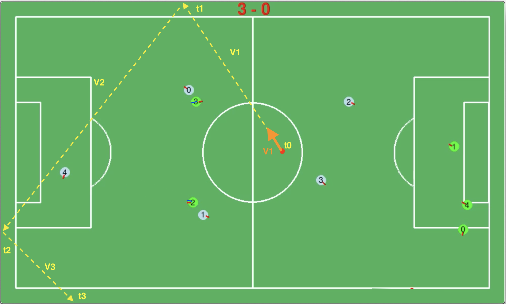

# Supporting functions: Capture the ball: Capture Position

##### [Go back to main page](../../../Documentation.md)

### Capture Position
Almost all capture ball functions are based on the time domain, not the space domain (when the event will happen, not where).
This is a result of how we decided to solve the trajectory intersections and collisions equations.
Although this method makes calculations simpler and more transparent, the strategic logic and controllers work in the spatial domain (where).
To provide an interface for external modules, the conversion method from time solution to spatial solution was needed.

### Assumptions, Inputs and Outputs
__Assumptions__: The ball is moving with uniform linear motion 

__Inputs__: Ball state, field size, time 

__Output__: Predicted ball state at a given time

### Logic

1. Generate ball trajectory, including a trajectory after the field side bounces.
2. Estimate the ball mean velocity over the trajectory components (including the friction and bounce energy loss).
3. Calculate position along the trajectory for a given time.

Figure 1 presents the trajectory with characteristic time events (bounces) and average velocities in specific trajectory components.

__Figure 1:__ Ball trajectory used to find ball position at the specific time.
