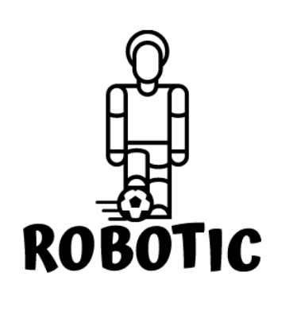

## Welcome to Robotic Team Design Project !

    
      
    <strong>Robotics Team Design Project at University of Glasgow</strong>

    
 
This project is about designing and simulating the RoboCup challenge - the football match with robots as players. The simulation involves two teams of five robots competing against each other. The robots are designed as two-wheel differential drive machines with an internal logic processor and a capability to communicate with different robots.
 

     

